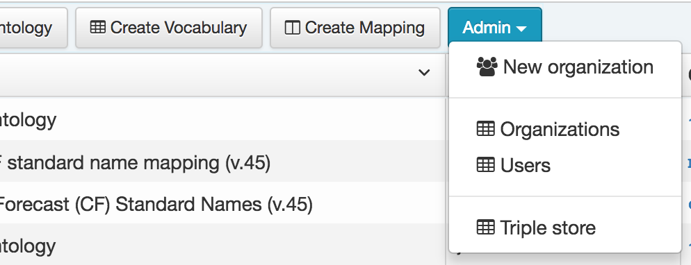
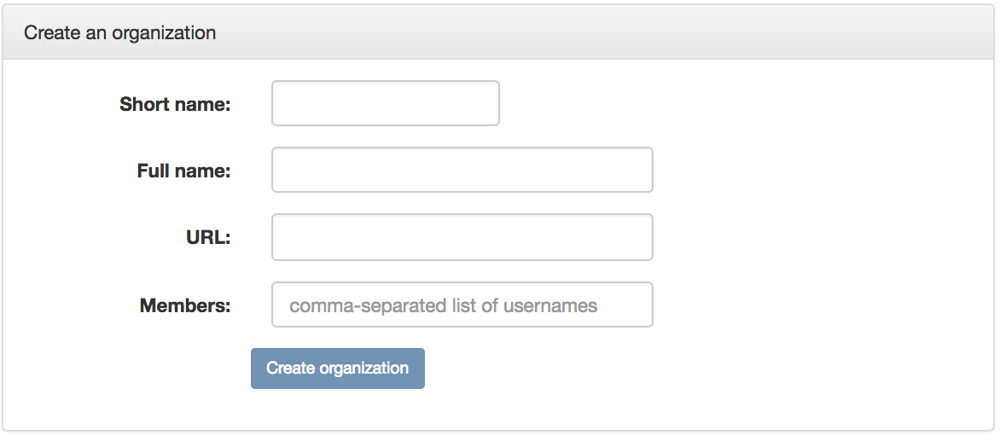
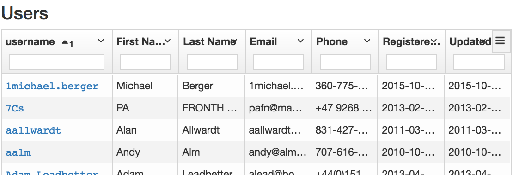
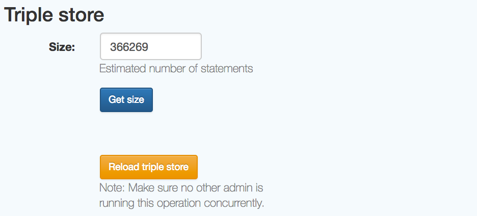

**Who are the administrators of an ORR instance?**

There will be an "admin" user automatically created upon initial start of the ORR
instance.  This user will have the username `admin` and password as indicated
in the master ORR configuration file. Besides this required admin user, there can
be any number of additional admin users. 
The relevant entry in the configuration file is as follows:

```
admin {
  # (required) Password of the 'admin' user:
  password = "--actual-admin-password--"

  # (required) Email address associated with the 'admin' user:
  email    = "me@example.net"

  # (optional) comma-separated list of usernames that will be granted 
  # admin privilege right upon creation of the correspoding account:
  #extra    = "foo,bar"
}
```

Once signed in, an admin user will be able to see and use additional
features in the ORR Portal interface. In particular, there will be
a dropdown menu that looks like so: 




**New Organization**

This option allows to create a new organization in the system:



**Organization list**


**Organizations**

This option displays the full list of organizations in the system:


**Users**

This option displays the full list of users in the system:



**Triple store**

This option allows to get the current size of the triple store
(approximate number of statements), and fully re-load the triple store 
with all registered ontologies in the system:
 


