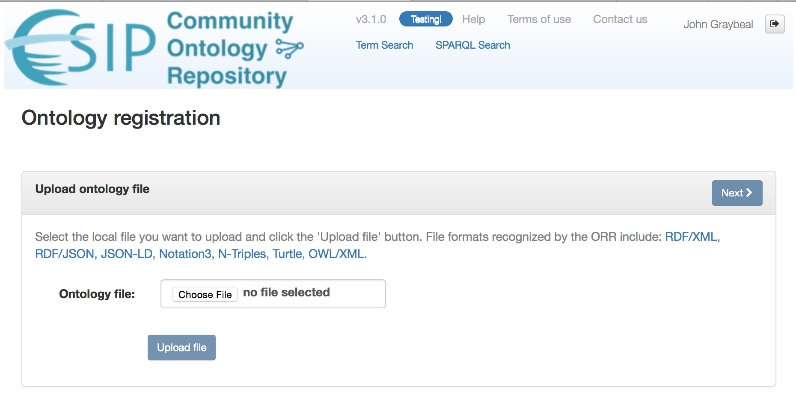
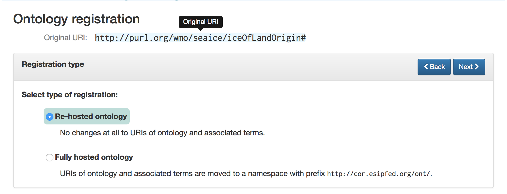
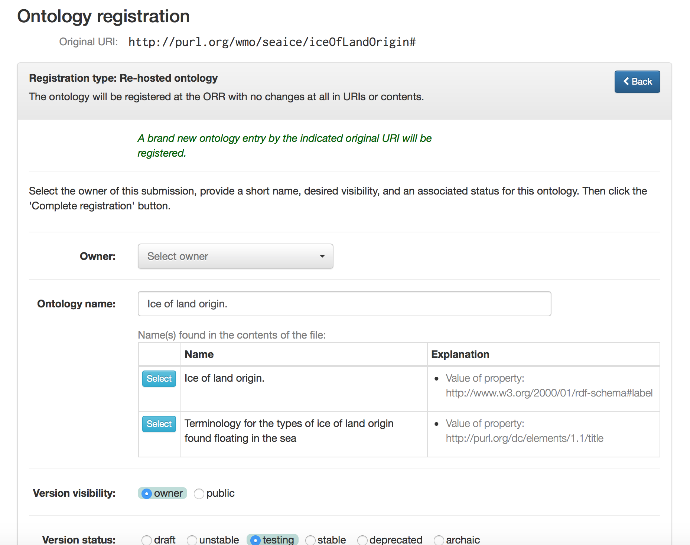
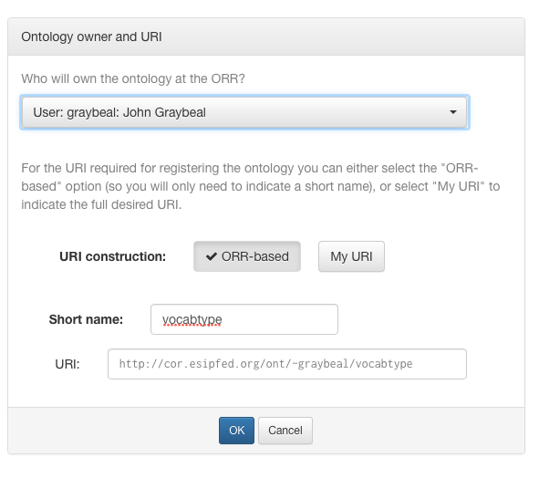
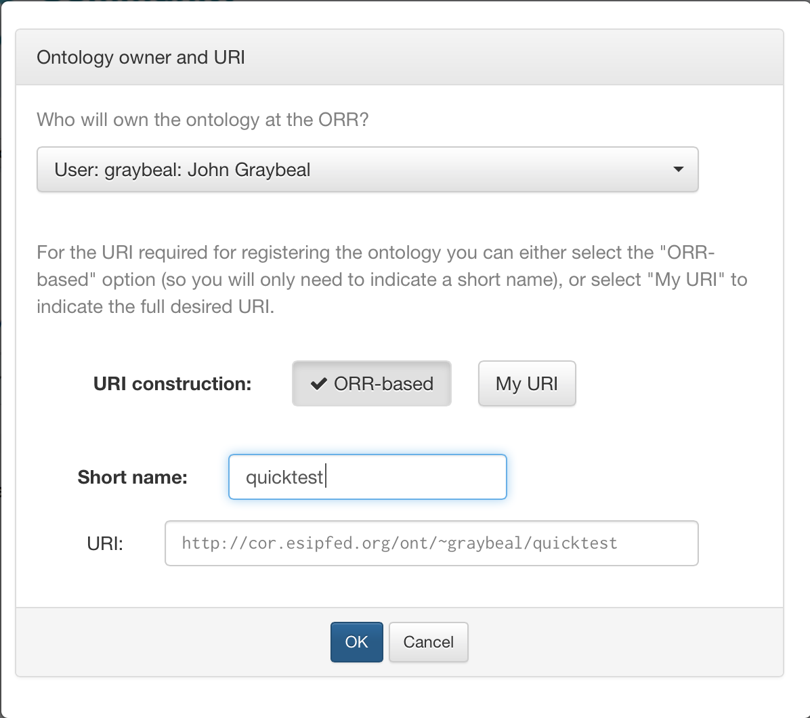
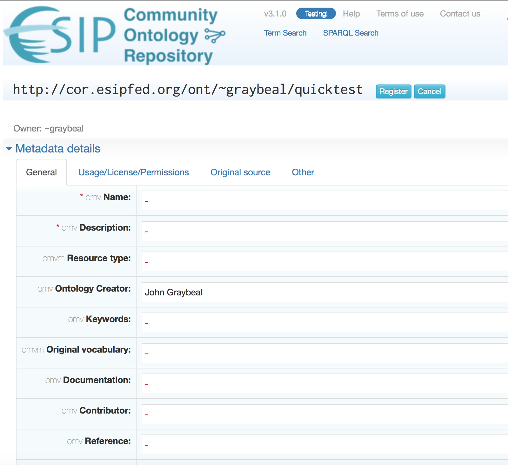
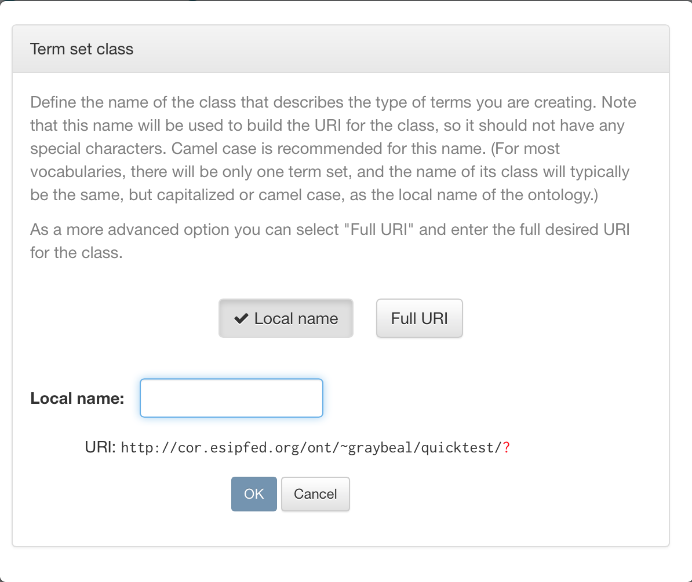
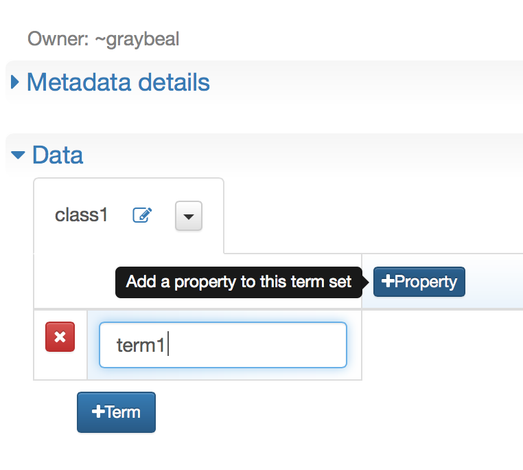

!!! tip
    _Page Status_: **In Progress**
    
!!! tip
    The screen shots in this presentation are made using the ESIP COR service.   
    Most features are also available in a similar form in the MMI ORR site; see the [MMI ORR help pages](https://marinemetadata.org/mmiorrusrman/mmiorrgetstarted) for details.
    
## Initial Access

**A. Open the desired ORR site in your browser**

* MMI ORR site: http://mmisw.org/orr/   
* ESIP COR site: http://cor.esipfed.org

**B. Log in**

You can access all publicly visible ontologies (see next section) without logging in. To change content, or see ontologies private to you or your group listed in the browse page, you must log in. (If you do not have an account, see *C. Create an account* below.)

If you are not yet signed in, click the "Sign in" link in the main ORR page, and enter your account information:

**C. Create an account**

If you do not have an account and want to log in, click the "Create account" link in the main ORR page, and fill out the resulting form: 

The telephone number is required, but is only used to assist in the operation of the repository.

## Using existing semantic data

**A. Browse list of registered ontologies**

Even if not signed in, you will see all public registered ontologies in the main ORR browse page. You will not see those ontologies that  are marked as Status="testing" or Visibility="owner". In the browse page, such ontologies are only visible to the submitter. (If you are the submitter, log in to see the non-public ontologies you submitted.)

The left-hand side tree widget allows you to select the entries in the ontology table according to the owner (the authority owning the ontology), submitter (if you are signed in),  status (testing, unstable, draft, stable, deprecated, or archaic), resource type (selected by the ontology submitter), and type of hosting (fully-hosted, or re-hosted). 

You can control which columns are visible using the 'hamburger' selector on the right. You can also click any column header in the table to have the list sorted by that column. 

Click the header again to reverse the order, or hold down the mouse button to see a delete option if available. (The URI column can not be submitted.)

**B. Explore contents of an ontology**

Click an entry in the browse table to explore a particular ontology.

The main operations available when viewing an ontology are:

* Copy the ontologies URI to the clipboard, using the button with the clipboard icon.

* View or download the ontology in a particular format. The viewing options are "RDF/XML" "N3", "Turtle", and "N Triples". Ontologies can also be downloaded in JSON-LD or RDF/JSON formats. Just choose the desired format in the list.

* View list of versions of the ontology: click the "Versions" button.

* Viewing the metadata details in the various categories shown in the tabs.

If you are an owner of the original ontology, you have additional options:

* Change the Status of the ontology.

* Change the Visibility of the ontology in the main browse page (either owner-only, or publicly visible). Note all ontologies, even owner-only, can still be viewed by anyone having the URI. 

* Create a new version (if you or your group submitted the original ontology): Click the "Edit new version" button at the far left to start creating a new version of the ontology. This also allows editing the ontology's metadata.

**D. Search for term**

In the main ORR page or any ontology page, click the "Term Search" link. You will see a page that looks like the following:

The given string will be searched exactly as typed, ignoring case, across all property values in the latest version of each registered ontology. You can use "OR" to separate alternate strings for the search.

**E. Perform a SPARQL query**

Also in the main ORR page or any ontology page, click the "SPARQL query" link. You will see a page that looks like the following:

This page provides an interface that let you enter example or customized SPARQL queries to run against the latest version of all the registered ontologies in the repository. It also provides the location of the SPARQL interface, allowing it to be accessed programmatically.

## Providing semantic content 

### Adding an ontology

To create or upload and register an ontology, you must be logged in as described above.

**A. Upload ontology file or create vocabulary**

You may be adding an ontology -- that is, a file in RDF, OWL, or similar form -- or a vocabulary, for example in a text file. Choose the appropriate section before for your situation.

***A.1. Upload existing ontology file and associated metadata***

If you already have an ontology file, click the "Upload ontology" button on the main page to submit it the ORR.
(Please see the ["Registering your existing ontology"](http://mmisw.org/orrdoc/upload/) page] for more details about ontology upload features.)

A wizard dialog will appear. In the wizard, select the local file and load it to the workspace. 

In the following dialog, you will either select or enter the URI used as the ontology URI. If the system detects an ontology IRI candidate within the ontology, the URI will be shown as a selection item, as shown in this dialog. Click on the select button to choose any IRI that you want to use as the ontology URI.

Once the Next button is selected, any metadata detected in the imported ontology is shown in the next dialog.

Next you will be asked to choose the type of registration (fully-hosted or re-hosted).  Details about these options are provided in the ["Registering your existing ontology"](http://mmisw.org/orrdoc/upload/) section]. 

Finally, you will complete the metadata details necessary for registering your ontology. These include the individual or organizational owner (shown below), a short name for the final URI for the ontology, the visibility of the ontology in the browse page, and the status of the ontology.  

")

!!! tip 
	If you are testing the process or your ontology, please choose "testing" as the status, so that your ontology is not visible to all the other users.

When you complete this step, ORR should tell you the ontology is successfully registered.

**A.2. Upload vocabulary file and associated metadata**

If you have your vocabulary in a delimited text file, then you may follow these steps. You will not be able to directly upload your vocabulary, but may paste in the text from your vocabulary file into a dialog box.

Once signed in, click "Upload vocabulary" button in the main ORR page. Enter the owner of the vocabulary (yourself, or a group that you are a member of), and the short name of the vocabulary that will appear in the URL for the vocabulary. You can enter your own URI for the vocabulary if you are an advanced user and want the URI to be in your own domain, but this is an unusual use case.

Complete the metadata in the "Metadata details" section. Starred items are required, and pop-up help describes all the metadata items when you mouse over the item's name. Note there are several tabs in this section, though only a few fields on the first tab must be completed.

In the "Data" section, click on the *+Term set* button. You will be prompted for the name of your first set of terms in this vocabulary. Usually this will be the same as the local name of the ontology -- vocabtypes in the example -- but in camel case (vocabTypes). 

When you click OK, a tab will be created for this vocabulary. 

To import your vocabulary, click on the drop-down arrow and choose the option "Import CSV contents". 

This will produce the following dialog box.

 

Follow the instructions in the dialog box, and click on Import when you are ready to import your text. You will be prompted for a Confirmation, as you will be entirely replacing the existing set of terms. If you are following these instructions, there are no existing terms to replace at this point. Click on OK to create the vocabulary data in preliminary form.

You can then review and register the ontology (step A.4 below). Please see the ["Creating a Vocabulary"](http://mmisw.org/orrdoc/vocab/new/) page for more details on this process.

**A.3. Create vocabulary contents and associated metadata**

The software also lets you create the vocabulary contents manually, via the user interface.

Once signed in, click the "Create vocabulary" button in the main ORR page.

To register your vocabulary, you need to create metadata to describe the ontology. Required metadata is shown with a red asterisk.

If you aren't sure what a particular metadata field means, hover over the field to get help.

You can start by selecting a local class name -- this is a required field

Then you can fill in the vocabulary contents, that is, the list of terms and associated properties, or information, for each term. Click on +Term to add a new term, and +Property to add a new piece of information that needs to be filled in for each term.

**A.4. Register the resulting vocabulary**

When you have filled out the ontology with at least one term and one property, it is ready to be registered. When you are done with the contents and metadata for your vocabulary, click on the Register button to create the ontology. 

You may get an error message indicating that the ontology cannot be registered according to the provided information, or without providing some key information. Resolve the issue in order to complete the registration.
 

