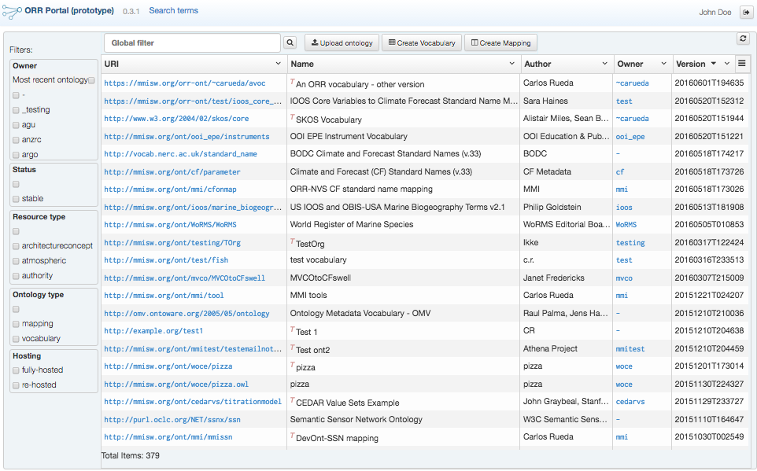

Contents being migrated from 
[https://marinemetadata.org/mmiorrusrman/mmiorrintro](https://marinemetadata.org/mmiorrusrman/mmiorrintro)

The [MMI Ontology Registry and Repository](http://mmisw.org/orr) (ORR) is a Web-based application, which serves as a 
single point of entry, where ontology providers and users can collaborate to create, host, annotate, share, and use 
ontologies of relevance to the marine science community.

In the ORR, at the most basic level, a term is given a URL, and the ORR will return a set of basic information when 
someone enters that URL into their browser. For a more advanced example, a data provider or system developer wanting
to annotate data sets can use this service as a first step to determine if any appropriate vocabularies already exist,
either for reuse or extension to suit the particular application. As another example, upon receiving a request for 
datasets involving a particular term (e.g., sea temperature), a data discovery tool can use the MMI ORR search 
service to enhance the result set by also requesting related terms (e.g., terms that may be broader than or 
narrower than the specific term).  These related terms are automatically obtained using mapping ontologies
and semantic inference mechanisms through the MMI ORR.

This set of services is a key component of the [Semantic Framework](http://marinemetadata.org/semanticframework) 
developed by the [Marine Metadata Interoperability Project](http://marinemetadata.org) (MMI).

**Main MMI ORR Capabilities**

*   Create and publish vocabularies in standards-based model (RDF)
*   Search for terms using free text or a sophisticated, standard query language (SPARQL)
*   Provide web resolvable identifiers for vocabularies and terms
*   Establish relations between terms to interlink your vocabulary with others in the community
*   Enable added-value applications with semantic and inference capabilities via programmatic access

This manual describes the MMI Ontology Registry and Repository and associated semantic services. 
The provided suite of key functions allows data providers and users to include, use, and exploit
semantic information in real world scenarios.
