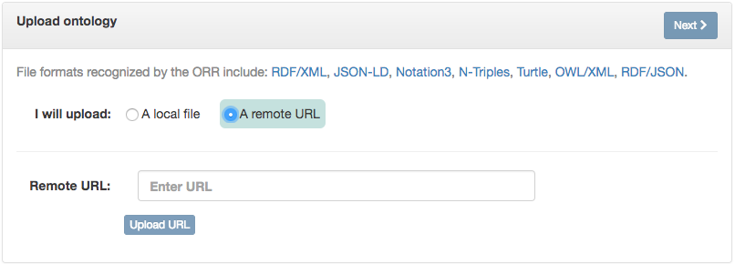
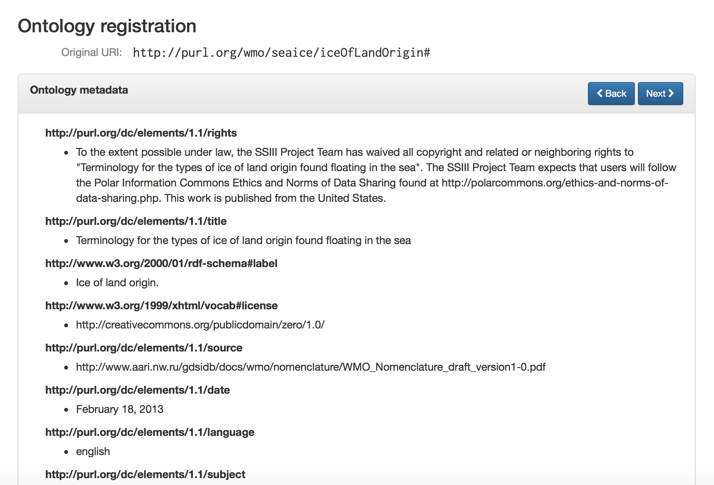

!!! warning
    _Page Status_: **In Progress** 

## Before you start: Things to know

### What formats are supported for registering ontology files?

The following formats are supported:

*   [RDF/XML](https://www.w3.org/TR/REC-rdf-syntax/)
*   [JSON-LD](https://www.w3.org/TR/json-ld/)
*   [Notation3](https://www.w3.org/TeamSubmission/n3/)
*   [N-TRIPLE](https://www.w3.org/TR/n-triples/)
*   [TURTLE](https://www.w3.org/TeamSubmission/turtle/)
*   [OWL/XML](https://www.w3.org/TR/owl-xml-serialization/)
*   [RDF/JSON](https://www.w3.org/TR/rdf-json/)

### What options are available for hosting ontologies?

ORR offers two options to register an existing ontology: _fully-hosted_ mode and _re-hosted_ mode.
These strongly affect the way your ontology and its terms are treated by the ORR.

#### Fully-hosted ontology

In this case, ORR will assign an IRI base, corresponding to the URL where the particular ORR
instance is installed, to your ontology and its associated 
terms sharing the same namespace. 
For example, this base URL is `http://cor.esipfed.org/ont` in the case of the COR instance.
More specifically, the original base IRI of the ontology will be 
overwritten with one assigned by ORR during the registration process.
  
*   **IRI Resolvability.** The ORR based IRIs given to your ontology (and to all the terms in the 
associated namespace) will be self-resolvable, i.e., you will be able to directly enter them into your 
browser or semantic web tool to get it resolved to the contents of your ontology or term. 
The indirect mechanisms described below are also provided in this case.
  

#### Re-hosted ontology

The general registration process is similar to the fully hosted option, but 
no changes at all will be performed in the contents 
(that is, in terms of modifying any defined IRIs/URIs in the ontology).

*   **IRI Resolvability.** 
The IRIs of your ontology and associated terms can be resolved indirectly 
via the "uri" parameter, eg., 
`http://mmisw.org/ont?uri=http://example.com/my/ontologyuri`. 
You can also indirectly access the ontology and terms via searches against ORR. 
(NOTE: Your ontology could also be resolved by its own IRI if that is supported by its 
original web server.)  

Regardless of the hosting mode, the following applies:

*   **Versioning**. Full support for versioning.
    Unless indicated otherwise, always the latest version will be dispatched in the ORR Portal
    and responded for a programmatic ontology request.
    A particular version can be selected in the ORR Portal page for the ontology,
    and a `version` parameter can be included in a request to retrieve a specific version.
    

*   **Ontology owner responsibilities.** The owner will submit the ontology, 
    provide the requested metadata, and review the ontology once it has been submitted to the ORR. 
    The owner will also provide updates directly to the repository.  

The following section provides instructions on how to submit an existing ontology to the ORR.

## Uploading an ontology

To upload and register an ontology, you must be logged in as described above,
and have available an ontology file in one of the above formats.

Click the "Upload ontology" button on the main page to begin the submission process.

A wizard dialog appears. 
The first step is to load the intended contents in the workspace.
For this you can either upload a local file:

or a remote URL:

 
### Uploading a local file

Upon selecting and uploading your local file,
you will then either select or enter the URI used as the ontology identifier. 
The field for this purpose is labeled "Original ontology URI."
If the system detects an ontology IRI candidate within the ontology, the IRI will be shown as a selection item, as shown in this dialog. Click on the select button to choose any IRI that you want to use as the ontology URI.

### Uploading an ontology from a remote URL

Upon entering the remote URL and clicking the 'Upload URL' button,
and similarly as with the local file case above,
you will then determine the URI to be used as the ontology identifier
as indicated in the "Original ontology URI" field. 
This field is initialized with the given remote URL, 
but you can adjust this as appropriate.

### Remaining upload sequence

Once the `Next` button is selected, any metadata detected in the imported ontology is shown in the next dialog.

Next you will be asked to choose the type of registration (fully-hosted or re-hosted).  Details about these options are provided in the section above. 

Finally, you will complete the metadata details necessary for registering your ontology. 
These include the individual or organizational owner (shown at right), 
a short name used as part of the final IRI for the ontology, 
the visibility of the ontology in the browse page, 
and the status of the ontology.  

!!! tip 
    If you are testing the process or your ontology, please choose "owner" as the value 
    for the visibility attribute so that your ontology is not visible to all the other users.
    

When you complete this step, ORR should tell you the ontology is successfully registered.

