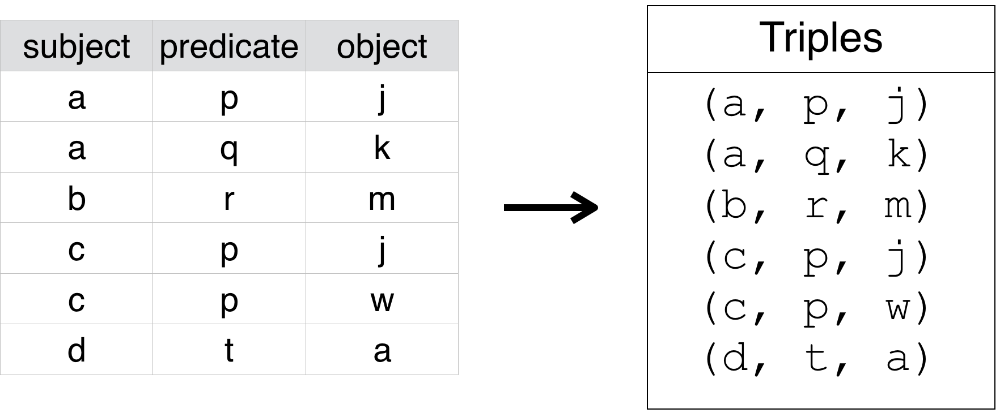
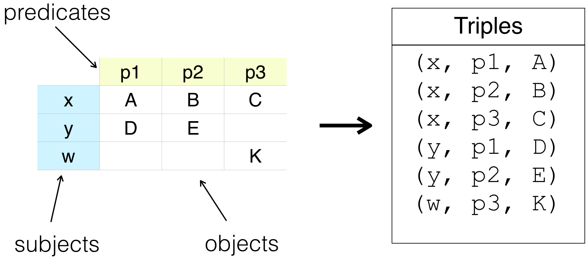

!!! warning
    _Page Status_: **Under revision**

## Core Concepts and Mechanisms

This section provides basic background on semantic concepts as they
pertain to a semantic application like the ORR, and
introduces related terminology used in both the ORR software 
and this documentation.[^rueda]
 
The Semantic Web is about capturing information, using standards-based
formal knowledge representation structures and mechanisms, to make such
information processable by machines, thus facilitating its sharing and 
reuse across disparate systems and applications.[^swactivity]

The Resource Description Framework (RDF)[^rdfprimer] is one of the fundamental 
Semantic Web specifications. 
Anything can be a resource, including physical things, documents, 
abstract concepts, web pages, numbers, and strings.

In RDF, the basic element of knowledge representation is the _triple_,
which establishes a concrete connection between specific resources,
and has the form:

&lt;_subject_> &lt;_predicate_> &lt;_object_>

Resources can be denoted to by IRIs[^iri] and literals. 
IRIs are used to identify resources and to link to them.
Literals denote values according to known datatypes (e.g., numbers, 
strings, and dates).

Generally speaking, an _ontology_ or _vocabulary_ is a given set of RDF triples. 
The complexity of a given ontology or vocabulary largely depends on the 
agreed-upon semantics associated with the triples in the set
(and in particular, to their predicates).
In fact, a number of standard _vocabularies_ have been developed to attach
well-defined semantics at various levels of sophistication.

Among the standard vocabularies, and the terms they define, are:
 
- The Resource Description Framework (RDF)[^rdfprimer] itself:
    - type, Property, Statement, subject, predicate, object
- RDF Schema (RDFS)[^rdfs]:
    - Resource, Class, subClassOf, subPropertyOf, comment, label, seeAlso, isDefinedBy
- Simple Knowledge Organization System (SKOS)[^skosprimer]:
    - definition, note, exactMatch, closeMatch, relatedMatch
- Web Ontology Language (OWL)[^owlprimer]:
    - Ontology, inverseOf, ReflexiveProperty, sameAs, versionInfo
- Dublin Core Terms (DCT)[^dct]:
    - title, description, creator, contributor, rights, license
- Ontology Metadata Vocabulary (OMV):[^omv]
    - name, description, hasCreator, keywords

## Capturing RDF triples

The ORR is not intended as a full-fledged ontology editor. 
However, it includes two integrated tools to facilitate the definition
of ontologies by defining the triples at the RDF level. 
This ORR functionality is described in more detail in later sections. 
Below are the key conceptual models underlying those tools.

### Direct triple table

A direct way to capture the set of triples comprising a given ontology
is via a subject-predicate-object table:

The _ORR mapping tool_ uses such a mechanism, wherein the set of predicates
are taken from the SKOS vocabulary, and the sets of subjects and objects
are selected by the user from given _mapped ontologies_.

### Another triple table arrangement

Another table arrangement to capture RDF triples is illustrated as follows:

The column headers capture the desired predicates, the row headers capture 
the subjects, and the cell entries capture the objects.

The _ORR vocabulary_ tool uses this mechanism. 

[^rueda]: Some of the materials in this section adapted from the presentation, 
[Semantic Web: 
Core Concepts and Mechanisms
 and the MMI Ontology Registry and
Repository](https://speakerdeck.com/carueda/semantic-web-core-concepts-and-mechanisms-and-mmi-orr-ontology-registry-and-repository).
  C. Rueda. ESIP 2016 Summer Meeting.
  July 19, 2016.

[^swactivity]: W3C Semantic Web Activity Statement - 
[https://www.w3.org/2001/sw/Activity](https://www.w3.org/2001/sw/Activity)

[^rdfprimer]: W3C RDF Primer - 
[https://www.w3.org/TR/2002/WD-rdf-primer-20020319/](https://www.w3.org/TR/2002/WD-rdf-primer-20020319/)

[^iri]: IRI: Internationalized Resource Identifier - 
[https://en.wikipedia.org/wiki/Internationalized_Resource_Identifier](https://en.wikipedia.org/wiki/Internationalized_Resource_Identifier)

[^rdfs]: RDF Schema -
[https://www.w3.org/TR/rdf-schema/](https://www.w3.org/TR/rdf-schema/)

[^skosprimer]: Simple Knowledge Organization System (SKOS) Primer -
[https://www.w3.org/TR/2009/NOTE-skos-primer-20090818/](https://www.w3.org/TR/2009/NOTE-skos-primer-20090818/)

[^owlprimer]: Web Ontology Language (OWL) Primer - 
[https://www.w3.org/TR/owl2-primer/](https://www.w3.org/TR/owl2-primer/)

[^dct]: Dublin Core Terms (DCT) -
[http://dublincore.org/documents/dcmi-terms/](http://dublincore.org/documents/dcmi-terms/)

[^omv]: Ontology Metadata Vocabulary (OMV) for the Semantic Web 
[http://ontolog.cim3.net/file/resource/OOR/OMV/OMV-Reportv2.4.1.pdf](http://ontolog.cim3.net/file/resource/OOR/OMV/OMV-Reportv2.4.1.pdf)
